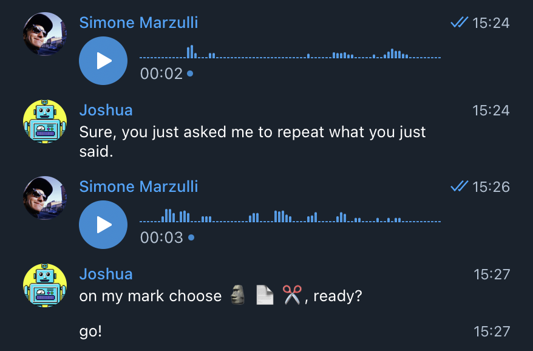

# Joshua


A *plugins* based bot for [Telegram](https://telegram.org/) messaging app written in Ruby.

## Installation

Install required dependencies:

```
$ sudo apt-get install ffmpeg wget
```

Clone this repository and then run `bundle` to install the dependencies.

```
$ git clone git@github.com:syxanash/joshua_bot.git
$ cd joshua_bot
$ bundle install
```

## Usage

Enter a valid bot API token in `config.json` (see **Configure** below) then run the bot with:

```
$ ruby bot.rb
```

A log file will be created in `/tmp/joshua_bot_tmp` directory with a random name (e.g. `bot_1b3510f004bd.log`)

## Configure

### Bot API Token

Before running the bot you need to add a telegram API key for your bot to the file `config.json`. Check out the official [telgram documentation](https://core.telegram.org/bots#3-how-do-i-create-a-bot) to achieve this.

Here's an example of a `config.json` once you have your API key set up:

```json
{
  "token": "103414657:AAGh0I6l-CKf_TDu6CUNa7c7MgnfRbUDzMQ",
  "prod": true,
  "temp_directory": "/tmp/joshua_bot_tmp",
  "plugin_folder": "basic",
  "password": "",
  "startup_commands": ["/xkcd"],
  "openai": {
    "token": "",
    "recognize_plugins": true,
    "max_interaction_history": 5,
    "log_prompts": false
  }
}
```

### Plugins

If you take a look at the folder `lib/plugins/` you will find different sub folders containing various plugins inside. By default the plugins loaded on the bot are in `basic/`. Alternatively you can specify a different folder in the `config.json` modifying the value `plugin_folder` (e.g. `"spioncino"`) .

You can create your own folder of plugins and drag plugins from other folders by making a new folder in `lib/plugins/`, for instance:

```
$ mkdir lib/plugins/workinprogress
```
Once you've done that you can specify the folder `"workinprogress"` inside `config.json`.

**Notice** that the plugin `help.rb` will always be loaded since it resides in the root directory of the plugins `lib/plugins`. You can place in this folder all the plugins which will always be loaded by the bot.

### Bot Password

If you want to be the only one talking to your bot you can add a **tiny** layer of security setting up a *bot password*. By doing so everytime you start the conversation with the bot it will ask you for a password before interpreting various commands.

You can set a bot password in the `config.json` under the value `"password"`.

## Create Plugins

Each plugin is a class which extends the class `AbsPlugin`. A plugin should have the following four methods:

* `initialize` (not mandatory)
* `command`
* `show_usage`
* `do_stuff`
* `examples` (see [OpenAI Integration](https://github.com/syxanash/joshua_bot#openai-integration))

You can place a new plugin in the folder `lib/plugins` or inside a subfolder of this directory to group plugins all your plugins. For example `basic/` and `spioncino/` are two different plugin folders.

### initialize

It's a method used to *initialize* class variables and other settings used by the plugin. This method will be called when the bot is loading the plugins for the first time. Also see Ruby [object initialization](https://ruby-doc.org/docs/ruby-doc-bundle/UsersGuide/rg/objinitialization.html).

### command

This method should return the **regular expression** used to match a command which the bot will interpret. For instance:

```
def command
  /^\/fortune$/
end
```

In this case the plugin will be activated upon entering the command `/fortune`. A slightly more complex command could be instad:

```
def command
  /(^\/takephoto$|photo)/
end
```

Which will interpret either `/takephoto` or simply `photo`.

### show_usage

You can display a help message to show the user the correct usage of the plugin. This method will be called when the user invokes the command in a wrong way for example if the command requires additional parameters.

For instance the plugin [Spione](lib/plugins/spioncino/spione.rb) will call the method `show_usage` if the user invokes the command `/spione` without parameters. A correct usage of the plugin Spione would be `/spione on`.

### do_stuff

This method will contain the actual code executed when the command is invoked. You can send simple text messages to the user (see the plugin [Fortune](lib/plugins/basic/fortune.rb)), images (see [Xkcd](lib/plugins/basic/xkcd.rb) plugin) or audio messages (see [Say](lib/plugins/spioncino/say.rb)).

## Interacting with plugins

You can interact with plugins either by passing **additional parameters** when calling the plugin or by asking the user further questions by **reading the buffer**. An analogy to this could be passing information to a command line tool either by passing _arguments_ or using `STDIN` 😄

### Additional Parameters

Additional command's parameters will be stored in the formal parameter `match_result` of the method `do_stuff`. The plugin's additional parameters will be created if you define a regular expression which accepts extra parameters like:

`/^\/diceroll\s?(\d*?)?$/`

In this case **DiceRoll** plugin can be invoked by using the command `/diceroll` or you can pass an extra parameter as an integer like so: `/diceroll 50` (this plugin will now generate a random number from 1-50). `match_result` is an array which will contain all the captured variables of the matched plugin's regex.


### Read Buffer

If you want your plugins to be more interactive asking questions and evaluating replies, more like a conversation with the user, you can use `read_buffer()`. This method must be invoked in the `do_stuff` block of your plugin.

Here's an example of a simple plugin which makes the addition of two numbers:

```rb
def do_stuff(match_results)
  bot.api.send_message(chat_id: message.chat.id, text: "what's the first number?")
  first_number = read_buffer

  bot.api.send_message(chat_id: message.chat.id, text: "what's the second number?")
  second_number = read_buffer
    
  bot.api.send_message(chat_id: message.chat.id, text: "I'm not a calculator so F𝔘Ⓒk off")
  sleep(3)
  bot.api.send_message(chat_id: message.chat.id, text: "it's #{first_number.to_i + second_number.to_i}...")
end
```

And this is going to be the result:


Some plugins which use the session buffer are:

* [basic/lyrics.rb](lib/plugins/basic/lyrics.rb)
* [basic/randomlogo.rb](lib/plugins/basic/randomlogo.rb)
* [basic/morra.rb](lib/plugins/basic/morra.rb)
* [spioncino/remote.rb](lib/plugins/spioncino/remote.rb)

### Startup commands

When a bot is protected by **password** you can execute a sequence of commands as soon as the user logs in. Take a look at `config.json` you'll find an array called `startup_commands`. You can edit this variable and add your list of startup commands that you wish to execute after logging in.

For example:

```
  "startup_commands": ["/diceroll 12", "/ping", "/morra"]
```

And this will be the output after entering the password correctly:


### Stopping a plugin

In order to stop a bot from asking further inputs and replies from a user, perhaps because of a bug or an unforeseen loop condition in your code, you can type the command `/cancel` and the plugin will terminate its execution.

### Logging

By default, a log file will be created in `/tmp/joshua_bot_tmp` (you can change this by editing the `temp_directory` name in `config.json`). Alternatively, if you'd like to redirect all output to STDOUT while testing your bot, simply change the variable `prod` to `false` in `config.json`.

## OpenAI Integration

Thanks to the [OpenAI APIs](https://platform.openai.com/docs), you can chat with Joshua Bot using ChatGPT. This feature is **completely optional** and this bot will work even without OpenAI. OpenAI APIs are used to interpret commands of various plugins or to just talk to your bot using ChatGPT.
To enable the bot to use OpenAI, enter your [OpenAI API Token](https://platform.openai.com/account/api-keys) in `config.json`.

### Interpreting commands
This feature is toggled on by default, so whenever you send a message to the bot without directly invoking a command, it will automatically try to interpret it as a command for executing a plugin. 


*(In this picture the [XKCD comic](lib/plugins/basic/xkcd.rb), the [dice roll](lib/plugins/basic/diceroll.rb) number and [battery status](lib/plugins/basic/battery.rb) are plugins executed by the bot)*

In order to let the bot recognize and execute plugins simply by chatting with it, you will need to add the examples when creating new custom plugins. _Examples_ will be used to train the bot to recognize the text based on the description and execute the related command.

This is the format you will need to follow:

```rb
def examples
  [
    { command: '/diceroll',    description: 'return a random number from 1 to 6' },
    { command: '/diceroll 10', description: 'return a random number from 1 to 10' }
  ]
end
```

Make sure the command in _examples_ matches the regex in `command` method of your plugin!
Take a look at the demo plugins to have an idea of how to write your own plugin and to make the bot execute commands: [morra.rb](lib/plugins/basic/morra.rb), [lyrics.rb](lib/plugins/basic/lyrics.rb), [randomlogo.rb](lib/plugins/basic/randomlogo.rb)<br>
If you'd like to talk to the bot only using ChatGPT without any command translation, you can toggle this feature off by setting the flag `recognize_plugins` to `false` in `config.json`.

### Bot Personality

The default personality of Joshua is the following:

```
Joshua is a helpful chatbot who enjoys chatting with any human who interacts with him.
```

This was hardcoded inside [ai_handler.rb](lib/ai_handler.rb). You can add extra traits to your bot in a personality file, which by default is called `personality.txt`. You can also rename or specify your own file in `config.json`.

Here's another example of more personality you can add to your bot inside `personality.txt`:

```
He's a very sarcastic bot that lives inside a Raspberry Pi (Zero W to be precise).
He really likes the movie WarGames and always tries his best to put some quotes from this movie.
```

### Voice Messages

When OpenAI integration is enabled and the user sends a voice message to the bot, this will automatically be transcribed using [Whisper APIs](https://openai.com/blog/introducing-chatgpt-and-whisper-apis). The transcription will then be used for interpreting plugins or communicating with ChatGPT.



## Spioncino


You should definitely tell your partner about an awesome implementation of this bot as a simple surveillance system for your mansion: [spioncino](SPIONCINO.md)

## Contributing

I've mostly devleoped this project in my freetime to learn Ruby and to play with Raspberry Pi & Arduino. I've certainly left some bugs and if you want to point out some code improvements feel free to open a PR!

1. Fork it
2. Create your feature branch (`git checkout -b my-new-feature`)
3. Commit your changes (`git commit -am 'Add some feature'`)
4. Push to the branch (`git push origin my-new-feature`)
5. Create new Pull Request

Pull requests are welcome. For major changes, please open an issue first to discuss what you would like to change.

## License

[MIT](LICENSE.txt)
