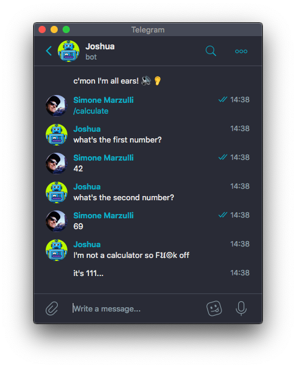

# Joshua


A *plugins* based bot for [Telegram](https://telegram.org/) messaging app written in Ruby.

## Installation

Clone this repository and then run `bundle` to install the dependencies.

```
$ git clone git@github.com:syxanash/joshua_bot.git
$ cd joshua_bot
$ bundle install
```

## Usage

Enter a valid bot API token in `config.json` (see **Configure** below) then run the bot with:

```
$ ruby bot.rb
```

A log file will be created in `/tmp/joshua_bot_tmp` directory with a random name (e.g. `bot_1b3510f004bd.log`)

## Configure

### Bot API Token

Before running the bot you need to add a telegram API key for your bot to the file `config.json`. Check out the official [telgram documentation](https://core.telegram.org/bots#3-how-do-i-create-a-bot) to achieve this.

Here's an example of a `config.json` once you have your API key set up:

```json
{
  "token": "103414657:AAGh0I6l-CKf_TDu6CUNa7c7MgnfRbUDzMQ",
  "prod": true,
  "temp_directory": "/tmp/joshua_bot_tmp",
  "plugin_folder": "basic",
  "password": "",
  "startup_commands": ["/xkcd"],
  "openai": {
    "token": "",
    "max_interaction_history": 10,
    "log_prompts": true
  }
}
```

### Plugin Set

If you take a look at the folder `lib/plugins/` you will find different sub folders containing various plugins inside. By default the plugins loaded on the bot are in `basic/`. Alternatively you can specify a different set in the `config.json` modifying the value `plugin_folder` (e.g. `"spioncino"`) .

You can create your own set of plugins and drag plugins from other sets by making a new folder in `lib/plugins/`, for instance:

```
$ mkdir lib/plugins/workinprogress
```
Once you've done that you can specify the folder `"workinprogress"` inside `config.json`.

**Notice** that the plugin `help.rb` will always be loaded since it resides in the root directory of the plugins `lib/plugins`. You can place in this folder all the plugins which will always be loaded by the bot.

### Bot Password

If you want to be the only one talking to your bot you can add a **tiny** layer of security setting up a *bot password*. By doing so everytime you start the conversation with the bot it will ask you for a password before interpreting various commands.

You can set a bot password in the `config.json` under the value `"password"`.

## Create Plugins

Each plugin is a class which extends the class `AbsPlugin`. A plugin should have the following four methods:

* `initialize` (not mandatory)
* `command`
* `show_usage`
* `do_stuff`

You can place a new plugin in the folder `lib/plugins` or inside a subfolder of this directory to group plugins in sets. For example `basic/` and `spioncino/` are two sets of plugins.

### initialize

It's a method used to *initialize* class variables and other settings used by the plugin. This method will be called when the bot is loading the plugins for the first time. Also see Ruby [object initialization](https://ruby-doc.org/docs/ruby-doc-bundle/UsersGuide/rg/objinitialization.html).

### command

This method should return the **regular expression** used to match a command which the bot will interpret. For instance:

```
def command
  /^\/fortune$/
end
```

In this case the plugin will be activated upon entering the command `/fortune`. A slightly more complex command could be instad:

```
def command
  /(^\/takephoto$|photo)/
end
```

Which will interpret either `/takephoto` or simply `photo`.

### show_usage

You can display a help message to show the user the correct usage of the plugin. This method will be called when the user invokes the command in a wrong way for example if the command requires additional parameters.

For instance the plugin **NoirSensor** will call the method `show_usage` if the user invokes the command `/noirsensor` without parameters. A correct usage of the plugin NoirSensor would be `/noirsensor on`.

### do_stuff

This method will contain the actual code executed when the command is invoked. You can send simple text messages to the user (see the plugin **Fortune**), images (see **Xkcd** plugin) or audio messages (see **spioncino/Say**).

## Interacting with plugins

You can interact with plugins either by passing **additional parameters** when calling the plugin or by asking the user further questions by **reading the buffer**. An analogy to this could be passing information to a command line tool either by passing _arguments_ or using `STDIN` 😄

### Additional Parameters

Additional command's parameters will be stored in the formal parameter `match_result` of the method `do_stuff`. The plugin's additional parameters will be created if you define a regular expression which accepts extra parameters like:

`/^\/diceroll\s?([1-9]*?)?$/`

In this case **DiceRoll** plugin can be invoked by using the command `/diceroll` or you can pass an extra parameter as an integer like so: `/diceroll 50` (this plugin will now generate a random number from 1-50). `match_result` is an array which will contain all the captured variables of the matched plugin's regex.


### Read Buffer

If you want your plugins to be more interactive asking questions and evaluating replies, more like a conversation with the user, you can use `read_buffer()`. This method must be invoked in the `do_stuff` block of your plugin.

Here's an example of a simple plugin which makes the addition of two numbers:

```rb
def do_stuff(match_results)
  bot.api.send_message(chat_id: message.chat.id, text: "what's the first number?")
  first_number = read_buffer

  bot.api.send_message(chat_id: message.chat.id, text: "what's the second number?")
  second_number = read_buffer
    
  bot.api.send_message(chat_id: message.chat.id, text: "I'm not a calculator so F𝔘Ⓒk off")
  sleep(3)
  bot.api.send_message(chat_id: message.chat.id, text: "it's #{first_number.to_i + second_number.to_i}...")
end
```

And this is going to be the result:



Some plugins which use the session buffer are:

* `basic/lyrics.rb` 
* `basic/randomlogo.rb`
* `basic/morra.rb`
* `spioncino/remote.rb`

### Startup commands

When a bot is protected by **password** you can execute a sequence of commands as soon as the user logs in. Take a look at `config.json` you'll find an array called `startup_commands`. You can edit this variable and add your list of startup commands that you wish to execute after logging in.

For example:

```
  "startup_commands": ["/diceroll 12", "/ping", "/morra"]
```

And this will be the output after entering the password correctly:


### Stopping a plugin

In order to stop a bot from asking further inputs and replies from a user, perhaps because of a bug or an unforeseen loop condition in your code, you can type the command `/cancel` and the plugin will terminate its execution.

### Logging

By default, a log file will be created in `/tmp/joshua_bot_tmp` (you can change this by editing the `temp_directory` name in `config.json`). Alternatively, if you'd like to redirect all output to STDOUT while testing your bot, simply change the variable `prod` to `false` in `config.json`.

##  OpenAI Integration

Thanks to the [OpenAI APIs](https://platform.openai.com/docs), you can chat with Joshua Bot using ChatGPT. This feature is **completely optional** and this bot will work even without OpenAI.<br>
OpenAI APIs can be used to interpret commands of various plugins or to just talk to your bot using ChatGPT.
To enable the bot to use OpenAI, enter your [OpenAI API Token](https://openai.com/blog/openai-api) in `config.json`.


*(In this picture the [XKCD comic](lib/plugins/basic/xkcd.rb), the [dice roll](lib/plugins/basic/diceroll.rb) number and [battery status](lib/plugins/basic/battery.rb) were plugins executed by the bot)*

In order to let the bot recognize and execute plugins simply by chatting with it, you will need to add the examples when creating new custom plugins. _Examples_ will be used to train the bot to recognize the text based on the description and execute the related command.

This is the format you will need to follow:

```rb
def examples
  [
    { command: '/diceroll',    description: 'return a random number from 1 to 6' },
    { command: '/diceroll 10', description: 'return a random number from 1 to 10' }
  ]
end
```

Make sure the command in _examples_ matches the regex in `command` method of your plugin!
Take a look at the demo plugins to have an idea of how to write your own plugin and to make the bot execute these: [morra.rb](lib/plugins/basic/morra.rb), [lyrics.rb](lib/plugins/basic/lyrics.rb), [randomlogo.rb](lib/plugins/basic/randomlogo.rb)

You can customize different things in `openai` segment, for instance:

* the max number of conversation messages to store in the prompt to give your bot a bit of context when replying to a message
* the ability to recognize and execute plugins simply by talking to your bot
* store the generated OpenAI prompts inside the logs

## Spioncino


You should definitely tell your partner about an awesome implementation of this bot as a simple surveillance system for your mansion: [spioncino](SPIONCINO.md)

## Contributing

I've mostly devleoped this project in my freetime to learn Ruby and to play with Raspberry Pi & Arduino. I've certainly left some bugs and if you want to point out some code improvements feel free to open a PR!

1. Fork it
2. Create your feature branch (`git checkout -b my-new-feature`)
3. Commit your changes (`git commit -am 'Add some feature'`)
4. Push to the branch (`git push origin my-new-feature`)
5. Create new Pull Request

Pull requests are welcome. For major changes, please open an issue first to discuss what you would like to change.

## License

[MIT](LICENSE.txt)
