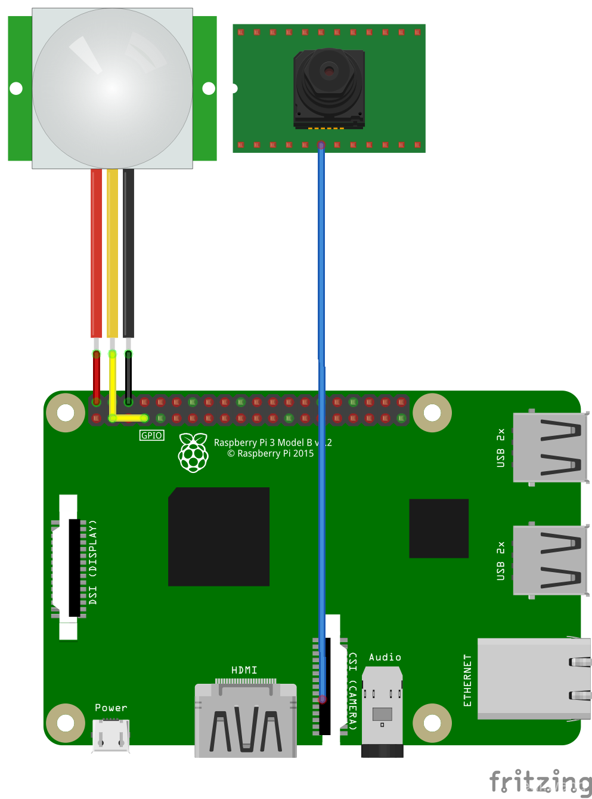

# Spioncino

An extremely simple surveillance bot running on a **Raspberry Pi** 🍓

&nbsp;

## Description

The surveillance system is composed of a bot that has a plugin called `spione.rb`, a [PIR](https://en.wikipedia.org/wiki/Passive_infrared_sensor) [sensor](https://learn.adafruit.com/pir-passive-infrared-proximity-motion-sensor/how-pirs-work) and [Raspberry Pi Camera Module](https://www.raspberrypi.org/products/camera-module-v2/). The plugin once activated will check the data coming from the PIR sensor which is used to detect movements of objects in a room. As soon as the sensor catches something for more than a few seconds the bot will send pictures and videos to the user.

By default the camera used to take pictures and videos is the **Raspberry Pi Camera Module**, alternatively I wrote a version of the plugin which works with a normal webcam connected to the Raspberry Pi via USB (see `old_spione.rb`).

## Installation

Install some dependencies which will be required for the surveillance plugin:

```
$ sudo apt-get install streamer fswebcam opus-tools espeak python3-picamera gpac imagemagick arp-scan
```

Clone this repository and then run bundle tool to install the dependencies.

```
$ git clone git@github.com:syxanash/joshua_bot.git
$ cd joshua_bot
$ bundle install
```

Edit the `config.json` with the following changes:

1. add your Telegram Bot API token inside the attribute `"token"`
2. change the attribute `"plugin_folder"` to `"spioncino"` instead of `"basic"`
3. protect the access of your bot with a password editing the `"password"` attribute

At this point no more changes are required and you can run the bot with:

```
$ ruby bot.rb
```

### PIR Sensor

You can change the sensitivity of the PIR sensor by modifying the config property `spioncino/pir_sensor_threshold` inside `config.json`. By default it will be set to value `8`, lower the number the more sensitive is the PIR so it will detect movements more frequently.

## Usage

Once everything is connected and the bot has been started, using the command `ruby bot.rb`, you should be able to talk to your bot. You could send some simple commands to verify it's up and running with `/ping`, the bot will reply with `pong`.

Here is a list of available commands for the main surveillance plugin:

Command  | Description
---------|------------
/spione **on**| Activates the plugin. It will start to detect the movement of objects using the PIR sensor and will send you pictures or videos when something moves in the room
/spione **off** | turns off the surveillance plugin and will stop sending pictures and videos in case it previously detected moving objects
/spione **idle** | checks if something has moved from the PIR sensor and will send just one photo subsequently it will turn off the plugin automatically
/spione **status** | returns the status of the surveillance plugin which could be `on`, `off`, `idle`

Other plugins:

Command  | Description
---------|------------
/takephoto | sends one photo from the Raspberry Pi camera module. You need to edit the source code if you don't have the camera module, take a look at the method `take_photo()` from `old_spione.rb`
/takevideo | sends a 10 seconds video from the camera module. You need to edit the source code if you don't have the camera module, take a look at the method `take_video()` from `old_spione.rb`
/wifinfo | returns the WiFi access point name which the Raspberry Pi is connected to and the IP address used on the network
/remote | is an interactive command which allows you to poweroff the machine, reboot it or restart the Telegram Bot
/whoishome | see description below

## Who is Home?

Out of the box Spioncino folder will contain a plugin called `/whoishome`. This plugin lists the devices connected to the network the bot is running from. It uses the tool `arp-scan` in order to perform the scan of the subnet. You can also specify a file which contains a list of aliases for each address. The file should be in the following format:
```json
[
    {
        "name": "my-flatmate-phone",
        "mac": "AA:BB:CC:DD:EE:FF",
        "display": true
    },
    {
        "name": "my-smart-tv",
        "mac": "00:11:22:33:44:55",
        "display": false
    }
]
```
Feel free to edit this plugin in order to specify a different network interface for arp-scan or to change the alias list file name.

## Hardware

The scheme is fairly easy to build, you can follow many tutorials online as well, basically the PIR will be connected to the Raspberry Pi using the **GPIO** ports as follows:



_(scheme taken from [hackster.io](https://www.hackster.io/ediwang/raspberry-pi-surveillance-camera-with-linux-and-azure-318f40))_

Then you can either connect the Raspberry Pi Camera Module or a normal Webcam via USB.

## About

Unfortunately for how much I love writing code for this little project I wouldn't rely on such a simple surveillance system for my house :)

This project was originally created to experiment with Arduino _Firmata_, learn multithreading in Ruby and after a few years it was ported to Raspberry Pi.
The Arduino version which is no longer supported lies dead in `lib/plugins/legacy/motionsensor.rb`, [this](other/doc_assets/arduino.png) was the old schematics of the project. I even made a demonstration [video](https://www.youtube.com/watch?v=irJc_imOiuo) in my college dorm room.

Feel free to send some PR for bug fixing or new features!
